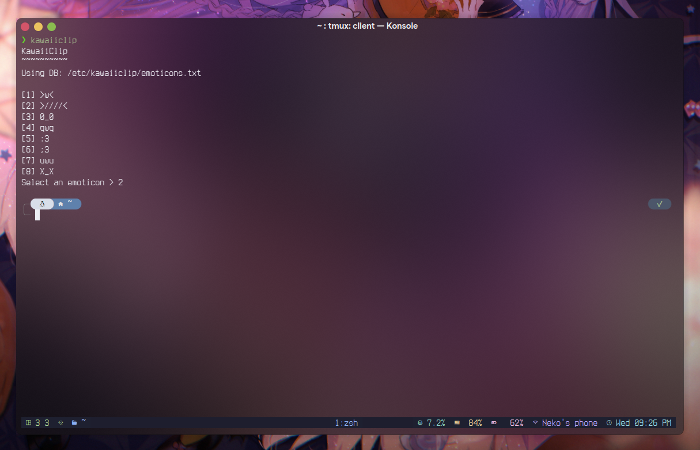

# kawaiiclip  
An emoticon clipboard with the feature of adding your own custom emoticons!  



# Usage  
execute by running `kawaclip` in your terminal  
also supports immediately copying by providing the ID beforehand `kawaiiclip -n NUMBER`  
to add or edit the list of emoticons you can edit either:  
`/etc/kawaiiclip/emoticons.txt`  
`~/.config/kawaiiclip/emoticons.txt`  
  
The app will prioritize the local list first (`~/.config/kawaiiclip/emoticons.txt`)  

# Installation  
## Ubuntu 24.04LTS based distros (and debian 13)  
Install the latest deb file from the releases or via github actions  

## Generic linux/UNIX installation  
```sh
curl -fsSL https://raw.githubusercontent.com/NekoMimiOfficial/kawaiiclip/refs/heads/main/install/linux_generic.sh | bash
```  

# Building  
## Ubuntu and Debian  
Building MUST be done from the root of the repository:  
```sh
./build/debian.sh
```  
Build output files found at `build/output/`  

# DISCLAIMER:  
For some reason, the config file isn't getting created. To fix this, create a folder called `kawaiiclip` in `~/.config` and in thart folder create a file named `emoticons.txt` . Each line is a new emoticon.  

# Hope you like it!  
Enjoy :3  
